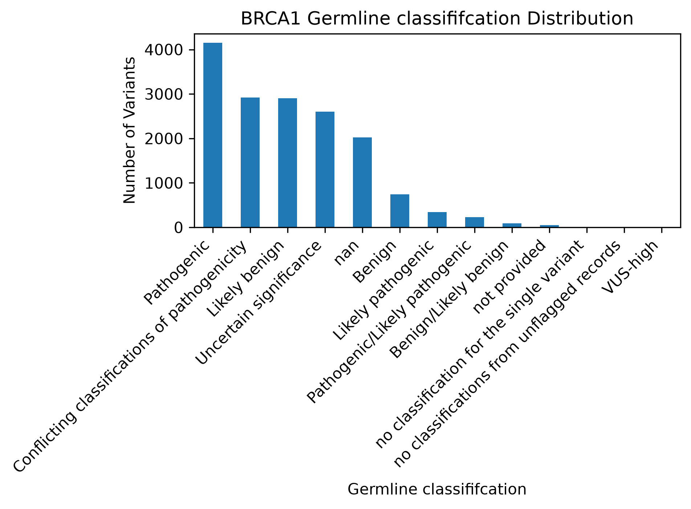
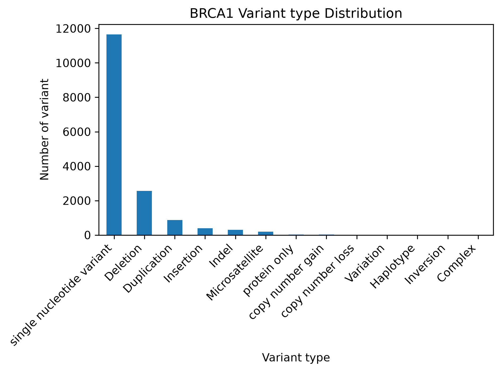
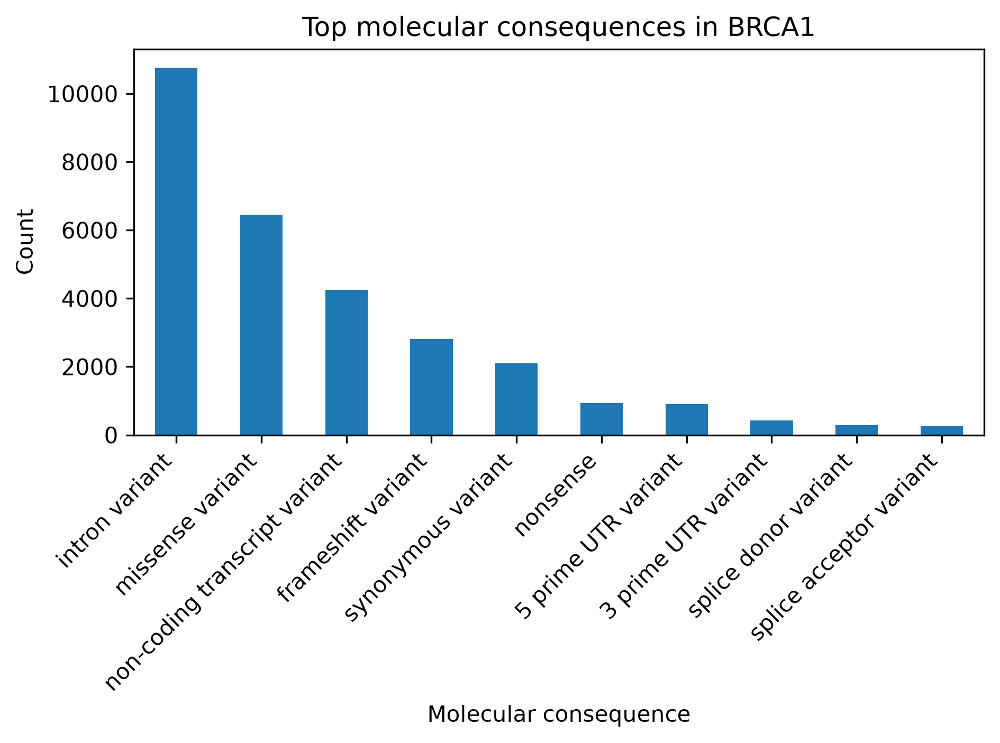
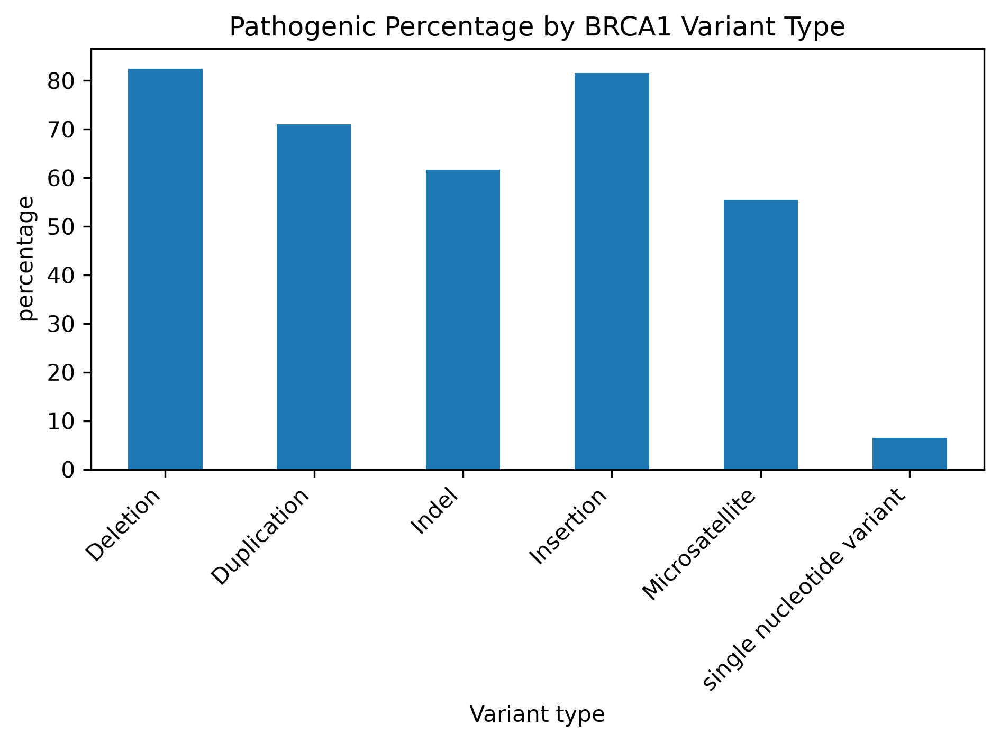

# BRCA1 Variant Analysis

# BRCA1 Variant Analysis

## Project Overview

This project analyzes BRCA1-related variants from ClinVar using Python.

The main objective is to explore how BRCA1 variants are distributed according to:

- Germline clinical classification
- Variant type
- Molecular consequence
- Pathogenic proportion by variant type

The project also compares examples of Pathogenic, Variant of Uncertain Significance (VUS), and Benign variants in order to better understand the difference between molecular consequence and clinical classification.

The analysis was designed as a practical bioinformatics project using real genomic variant data and common Python tools used in biological data analysis.

---

## Biological Background

BRCA1 is a tumor suppressor gene involved in DNA repair and the maintenance of genomic stability.

Genetic variants affecting BRCA1 can have different molecular consequences and different clinical interpretations.

### Germline Clinical Classification

ClinVar classifies germline variants into several categories:

- **Pathogenic**: available evidence supports an association with disease.
- **Likely pathogenic**: strong evidence suggests pathogenicity, but the evidence is not considered definitive.
- **Uncertain significance (VUS)**: available evidence is insufficient to determine whether the variant is pathogenic or benign.
- **Likely benign**: available evidence suggests that the variant is unlikely to be disease-causing.
- **Benign**: available evidence supports that the variant is not disease-causing.

A VUS should not be interpreted as Pathogenic or Benign without additional evidence.

### Variant Type

Variant type describes what changed in the DNA sequence.

Examples include:

- Single nucleotide variant
- Deletion
- Insertion
- Duplication
- Indel

### Molecular Consequence

Molecular consequence describes the effect that a variant may have on a transcript or protein.

Examples include:

- **Missense variant**: changes an amino acid.
- **Synonymous variant**: changes the DNA sequence without changing the amino acid.
- **Nonsense variant**: introduces a premature stop codon.
- **Frameshift variant**: changes the reading frame of the coding sequence.
- **Splice donor / splice acceptor variant**: may affect RNA splicing.

It is important to distinguish between:

- **Variant type**: what changed in the DNA
- **Molecular consequence**: how the transcript or protein may be affected
- **Clinical classification**: how the variant is interpreted clinically based on available evidence

These describe different aspects of the same variant.

A molecular consequence such as a frameshift does not automatically mean that the variant is clinically classified as Pathogenic.

### Multiple Transcripts

A gene can have several transcript isoforms because of alternative splicing.

As a result, the same genomic variant can have different molecular consequences depending on the transcript being considered.

For example:

```text
missense variant|intron variant|non-coding transcript variant
## Dataset

The dataset was exported from ClinVar and contains BRCA1-related variant records.

After validation, the dataset contained:

- 16,064 entries
- 24 columns

Main fields used:

- `Variant type`
- `Molecular consequence`
- `Germline classification`
- `Germline review status`
- `Protein change`

---

## Methods

The analysis was performed using Python with:

- `pandas` for data loading, filtering, counting, and summarization
- `matplotlib` for visualization
- `pathlib` for file path management

The main analysis steps were:

1. Load and validate the ClinVar TSV file
2. Analyze germline classifications
3. Analyze variant types
4. Split multiple molecular consequences using `|`
5. Calculate pathogenic percentages by variant type
6. Compare Pathogenic, VUS, and Benign examples

---

## Results

Main observations:

- Total BRCA1-related entries: **16,064**
- Pathogenic: **4,151**
- VUS: **2,601**
- Benign: **743**
- Single nucleotide variants were the most frequent variant type
- Deletions and insertions showed high pathogenic proportions among well-represented variant types in this dataset









---

## How to Run

```bash
pip install -r requirements.txt
python src/analyze_brca1.py